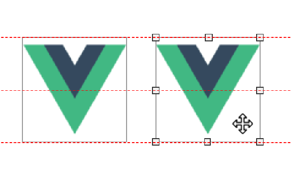

# dragresize

[](https://badge.fury.io/js/@fuyoo%2Fdragresize)
[](LICENSE.md)
[](https://www.npmjs.com/package/@fuyoo/dragresize)
[](https://github.com/a7650/@fuyoo/dragresize)

**this is a fork. from [a7650/vue3-draggable-resizable](https://github.com/a7650/vue3-draggable-resizable)**

> [Vue3 组件] 用于拖拽调整位置和大小的的组件，同时支持冲突检测，元素吸附对齐，实时参考线。
> [ Vue3 Component ] Draggable and resizable component for vue3, and, support element adsorption alignment, real-time reference line, etc.

[点击查看中文文档](./docs/document_zh.md)

## Table of Contents

- [Features](#features)
- [Usage](#Usage)
  - [Props](#props)
  - [Events](#events)
  - [Use adsorption alignment](#Use-adsorption-alignment)

### Features

- Draggable and resizable
- Define handles for resizing
- Restrict movement and size in parent node
- Customize various class names
- Provide your own markup for handles
- Adsorption alignment
- Reference line

### Usage

```bash
$ npm install @fuyoo/dragresize
```

Register the DragResize

```js
// >main.js
import { createApp } from 'vue'
import App from './App.vue'
import DragResize from '@fuyoo/dragresize'
//default styles
import '@fuyoo/dragresize/dist/DragResize.css'

// You will have a global component named "DragResize"
createApp(App)
  .use(DragResize)
  .mount('#app')
```

You can also use it separately within the component

```js
// >component.js
import { defineComponent } from 'vue'
import DragResize from '@fuyoo/dragresize'
//default styles
import '@fuyoo/dragresize/dist/DragResize.css'

export default defineComponent({
  components: { DragResize }
  // ...other
})
```

Here is a complete example of using "vue-template"

```vue
<template>
  <div id="app">
    <div class="parent">
      <DragResize
        :initW="110"
        :initH="120"
        v-model:x="x"
        v-model:y="y"
        v-model:w="w"
        v-model:h="h"
        v-model:active="active"
        :draggable="true"
        :resizable="true"
        @activated="print('activated')"
        @deactivated="print('deactivated')"
        @drag-start="print('drag-start')"
        @resize-start="print('resize-start')"
        @dragging="print('dragging')"
        @resizing="print('resizing')"
        @drag-end="print('drag-end')"
        @resize-end="print('resize-end')"
      >
        This is a test example
      </DragResize>
    </div>
  </div>
</template>

<script>
import { defineComponent } from 'vue'
import DragResize from '@fuyoo/dragresize'
//default styles
import '@fuyoo/dragresize/dist/DragResize.css'
export default defineComponent({
  components: { DragResize },
  data() {
    return {
      x: 100,
      y: 100,
      h: 100,
      w: 100,
      active: false
    }
  },
  methods: {
    print(val) {
      console.log(val)
    }
  }
})
</script>
<style>
.parent {
  width: 200px;
  height: 200px;
  position: absolute;
  top: 100px;
  left: 100px;
  border: 1px solid #000;
  user-select: none;
}
</style>
```

### Props

#### scale

type: `Number`<br>
default: `1`<br>

Set initial scale

```html
<DragResize :scale="1" />
```

#### initW

type: `Number`<br>
default: `null`<br>

Set initial width(px)

```html
<DragResize :initW="100" />
```

#### initH

type: `Number`<br>
default: `null`<br>

Set initial height(px)

```html
<DragResize :initH="100" />
```

#### w

type: `Number`<br>
default: `0`<br>

Current width(px) of the container.<br>
You can use "v-model:w" to keeps it up-to-date

```html
<DragResize v-model:w="100" />
```

#### h

type: `Number`<br>
default: `0`<br>

Current height(px) of the container.<br>
You can use "v-model:h" to keeps it up-to-date

```html
<DragResize v-model:h="100" />
```

#### x

type: `Number`<br>
default: `0`<br>

Current left(px) of the container.<br>
You can use "v-model:x" to keeps it up-to-date

```html
<DragResize v-model:x="100" />
```

#### y

type: `Number`<br>
default: `0`<br>

The current top(px) of the container.<br>
You can use "v-model:y" to keeps it up-to-date

```html
<DragResize v-model:y="100" />
```

#### minW

type: `Number`<br>
default: `20`<br>

Minimum width(px)

```html
<DragResize :minW="100" />
```

#### minH

type: `Number`<br>
default: `20`<br>

Minimum height(px)

```html
<DragResize :minH="100" />
```

#### active

type: `Boolean`<br>
default: `false`<br>

Indicates whether the component is selected.<br>
You can use "v-model:active" to keeps it up-to-date

```html
<DragResize v-model:active="100" />
```

#### draggable

type: `Boolean`<br>
default: `true`<br>

Defines the component can be draggable or not

```html
<DragResize :draggable="true" />
```

#### resizable

type: `Boolean`<br>
default: `true`<br>

Defines the component can be resizable or not

```html
<DragResize :draggable="true" />
```

#### lockAspectRatio

type: `Boolean`<br>
default: `false`<br>

The `lockAspectRatio` property is used to lock aspect ratio.

```html
<DragResize :lockAspectRatio="true" />
```

#### disabledX

type: `Boolean`<br>
default: `false`<br>

Defines the component can be moved on x-axis or not

```html
<DragResize :disabledX="true" />
```

#### disabledY

type: `Boolean`<br>
default: `false`<br>

Defines the component can be moved on y-axis or not

```html
<DragResize :disabledY="true" />
```

#### disabledW

type: `Boolean`<br>
default: `false`<br>

Defines the component`s width can be modify or not

```html
<DragResize :disabledW="true" />
```

#### disabledH

type: `Boolean`<br>
default: `false`<br>

Defines the component`s height can be modify or not

```html
<DragResize :disabledH="true" />
```

#### parent

type: `Boolean`<br>
default: `false`<br>

Restrict movement and size within its parent node

```html
<DragResize :parent="true" />
```

#### handles

type: `Array`<br>
default: `['tl', 'tm', 'tr', 'ml', 'mr', 'bl', 'bm', 'br']`

Define the array of handles to restrict the element resizing

- `tl` : Top left
- `tm` : Top middle
- `tr` : Top right
- `mr` : Middle right
- `ml` : Middle left
- `bl` : Bottom left
- `bm` : Bottom middle
- `br` : Bottom right

```html
<DragResize :handles="['tl','tr','bl','br']" />
```

#### classNameDraggable

type: `String`<br>
default: `draggable`

Used to set the custom `class` of a draggable-resizable component when `draggable` is enable.

```html
<DragResize classNameDraggable="draggable" />
```

#### classNameResizable

type: `String`<br>
default: `resizable`

Used to set the custom `class` of a draggable-resizable component when `resizable` is enable.

```html
<DragResize classNameResizable="resizable" />
```

#### classNameDragging

type: `String`<br>
default: `dragging`

Used to set the custom `class` of a draggable-resizable component when is dragging.

```html
<DragResize classNameDragging="dragging" />
```

#### classNameResizing

type: `String`<br>
default: `resizing`

Used to set the custom `class` of a draggable-resizable component when is resizing.

```html
<DragResize classNameResizing="resizing" />
```

#### classNameActive

type: `String`<br>
default: `active`

Used to set the custom `class` of a draggable-resizable component when is active.

```html
<DragResize classNameActive="active" />
```

#### classNameHandle

type: `String`<br>
default: `handle`

Used to set the custom common `class` of each handle element.

```html
<DragResize classNameHandle="my-handle" />
```

following handle nodes will be rendered

```html
...
<div class="vdr-handle vdr-handle-tl my-handle my-handle-tl"></div>
<div class="vdr-handle vdr-handle-tm my-handle my-handle-tm"></div>
<div class="vdr-handle vdr-handle-tr my-handle my-handle-tr"></div>
<div class="vdr-handle vdr-handle-ml my-handle my-handle-mr"></div>
...
```

### Events

#### activated

payload: `-`

```html
<DragResize @activated="activatedHandle" />
```

#### deactivated

payload: `-`

```html
<DragResize @deactivated="deactivatedHandle" />
```

#### drag-start

payload: `{ x: number, y: number }`

```html
<DragResize @drag-start="dragStartHandle" />
```

#### dragging

payload: `{ x: number, y: number }`

```html
<DragResize @dragging="dragStartHandle" />
```

#### drag-end

payload: `{ x: number, y: number }`

```html
<DragResize @drag-end="dragEndHandle" />
```

#### resize-start

payload: `{ x: number, y: number, w: number, h: number }`

```html
<DragResize @resize-start="resizeStartHandle" />
```

#### resizing

payload: `{ x: number, y: number, w: number, h: number }v`

```html
<DragResize @resizing="resizingHandle" />
```

#### resize-end

payload: `{ x: number, y: number, w: number, h: number }`

```html
<DragResize @resize-end="resizeEndHandle" />
```

### Use-adsorption-alignment

You need to import another component to use the "adsorption alignment" feature.

This can be used as follows.

```vue
<template>
  <div id="app">
    <div class="parent">
      <DragResizeContainer>
        <DragResize>
          Test
        </DragResize>
        <DragResize>
          Another test
        </DragResize>
      </DragResizeContainer>
    </div>
  </div>
</template>

<script>
import { defineComponent } from 'vue'
import DragResize from '@fuyoo/dragresize'
// This component is not exported by default
// If you used "app.use(DragResize)"，then you don't need to import it, you can use it directly.
import { DragResizeContainer } from '@fuyoo/dragresize'
//default styles
import '@fuyoo/dragresize/dist/DragResize.css'
export default defineComponent({
  components: { DragResize, DragResizeContainer }
})
</script>
<style>
.parent {
  width: 200px;
  height: 200px;
  position: absolute;
  top: 100px;
  left: 100px;
  border: 1px solid #000;
  user-select: none;
}
</style>
```

### DragResizeContainer Props

These props apply to DragResizeContainer

#### disabled

type: `Boolean`<br>
default: `false`<br>

Disable this feature

```html
<DragResizeContainer :disabled="true">
  <DragResize>
    Test
  </DragResize>
  <DragResize>
    Another test
  </DragResize>
</DragResizeContainer>
```

#### adsorbParent

type: `Boolean`<br>
default: `true`<br>

Adsorption near parent component

```html
<DragResizeContainer :adsorbParent="false">
  <DragResize>
    Test
  </DragResize>
  <DragResize>
    Another test
  </DragResize>
</DragResizeContainer>
```

#### adsorbCols

type: `Array<Number>`<br>
default: `null`<br>

Custom guides(column)

```html
<DragResizeContainer :adsorbCols="[10,20,30]">
  <DragResize>
    Test
  </DragResize>
  <DragResize>
    Another test
  </DragResize>
</DragResizeContainer>
```

#### adsorbRows

type: `Array<Number>`<br>
default: `null`<br>

Custom guides(row)

```html
<DragResizeContainer :adsorbRows="[10,20,30]">
  <DragResize>
    Test
  </DragResize>
  <DragResize>
    Another test
  </DragResize>
</DragResizeContainer>
```

#### referenceLineVisible

type: `Boolean`<br>
default: `true`<br>

reference line visible

```html
<DragResizeContainer :referenceLineVisible="false">
  <DragResize>
    Test
  </DragResize>
  <DragResize>
    Another test
  </DragResize>
</DragResizeContainer>
```

#### referenceLineColor

type: `String`<br>
default: `#f00`<br>

reference line color

```html
<DragResizeContainer :referenceLineColor="#0f0">
  <DragResize>
    Test
  </DragResize>
  <DragResize>
    Another test
  </DragResize>
</DragResizeContainer>
```
