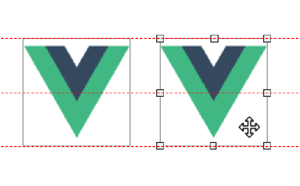

# DragResize

[](LICENSE.md)
[](https://github.com/a7650/vue3-draggable-resizable)


**这是[a7650/vue3-draggable-resizable](https://github.com/a7650/vue3-draggable-resizable)的fork**

> [Vue3 组件] 用于拖拽调整位置和大小的的组件，同时支持冲突检测，元素吸附对齐，实时参考线。

## 文档目录

- [特性](#特性)
- [使用方法](#使用)
  - [组件 Props](#props)
  - [组件 Events](#events)
  - [使用吸附对齐功能](#使用吸附对齐功能)

### 特性

- 支持拖拽和缩放，可分别定义开启或关闭
- 自定义缩放句柄（缩放时共有八个方位可操作，可分别定义开启或关闭）
- 限制组件的拖动和缩放在其父节点内
- 自定义组件内各种类名
- 缩放句柄的类名也可自定义
- 元素吸附对齐
- 实时参考线
- 自定义参考线
- 使用 Vue3 和 ts

### 使用

```bash
$ npm install vue3-draggable-resizable
```

使用 use 方法注册组件

```js
// >main.js
import { createApp } from 'vue'
import App from './App.vue'
import DragResize from 'vue3-draggable-resizable'
//需引入默认样式
import 'vue3-draggable-resizable/dist/DragResize.css'

// 你将会获得一个名为DragResize的全局组件
createApp(App)
  .use(DragResize)
  .mount('#app')
```

也可以单独在你的组件内部使用

```js
// >component.js
import { defineComponent } from 'vue'
import DragResize from 'vue3-draggable-resizable'
//需引入默认样式
import 'vue3-draggable-resizable/dist/DragResize.css'

export default defineComponent({
  components: { DragResize }
  // ...other
})
```

下面是一个使用 vue-template 语法写的例子

```vue
<template>
  <div id="app">
    <div class="parent">
      <DragResize
        :initW="110"
        :initH="120"
        v-model:x="x"
        v-model:y="y"
        v-model:w="w"
        v-model:h="h"
        v-model:active="active"
        :draggable="true"
        :resizable="true"
        @activated="print('activated')"
        @deactivated="print('deactivated')"
        @drag-start="print('drag-start')"
        @resize-start="print('resize-start')"
        @dragging="print('dragging')"
        @resizing="print('resizing')"
        @drag-end="print('drag-end')"
        @resize-end="print('resize-end')"
      >
        This is a test example
      </DragResize>
    </div>
  </div>
</template>

<script>
import { defineComponent } from 'vue'
import DragResize from 'vue3-draggable-resizable'
//default styles
import 'vue3-draggable-resizable/dist/DragResize.css'
export default defineComponent({
  components: { DragResize },
  data() {
    return {
      x: 100,
      y: 100,
      h: 100,
      w: 100,
      active: false
    }
  },
  methods: {
    print(val) {
      console.log(val)
    }
  }
})
</script>
<style>
.parent {
  width: 200px;
  height: 200px;
  position: absolute;
  top: 100px;
  left: 100px;
  border: 1px solid #000;
  user-select: none;
}
</style>
```

### Props


#### scale

type: `Number`<br>
default: `null`<br>

设置缩放系数

```html
<DragResize :scale="1" />
```

#### initW

type: `Number`<br>
default: `null`<br>

设置初始宽度（px）

```html
<DragResize :initW="100" />
```

#### initH

type: `Number`<br>
default: `null`<br>

设置初始高度（px）

```html
<DragResize :initH="100" />
```

#### w

type: `Number`<br>
default: `0`<br>

组件的当前宽度（px）<br>
你可以使用“v-model:w”语法使它和父组件保持一致

```html
<DragResize v-model:w="100" />
```

#### h

type: `Number`<br>
default: `0`<br>

组件的当前高度（px）<br>
你可以使用“v-model:h”语法使它和父组件保持一致

```html
<DragResize v-model:h="100" />
```

#### x

type: `Number`<br>
default: `0`<br>

组件距离父容器的左侧的距离（px）<br>
你可以使用“v-model:x”语法使它和父组件保持一致

```html
<DragResize v-model:x="100" />
```

#### y

type: `Number`<br>
default: `0`<br>

组件距离父容器顶部的距离（px）<br>
你可以使用“v-model:y”语法使它和父组件保持一致

```html
<DragResize v-model:y="100" />
```

#### minW

type: `Number`<br>
default: `20`<br>

组件的最小宽度（px）

```html
<DragResize :minW="100" />
```

#### minH

type: `Number`<br>
default: `20`<br>

组件的最小高度（px）

```html
<DragResize :minH="100" />
```

#### active

type: `Boolean`<br>
default: `false`<br>

组件当前是否处于活跃状态<br>
你可以使用“v-model:active”语法使它和父组件保持一致

```html
<DragResize v-model:active="100" />
```

#### draggable

type: `Boolean`<br>
default: `true`<br>

组件是否可拖动

```html
<DragResize :draggable="true" />
```

#### resizable

type: `Boolean`<br>
default: `true`<br>

组件是否可调整大小

```html
<DragResize :draggable="true" />
```

#### lockAspectRatio

type: `Boolean`<br>
default: `false`<br>

该属性用来设置是否锁定比例

```html
<DragResize :lockAspectRatio="true" />
```

#### disabledX

type: `Boolean`<br>
default: `false`<br>

是否禁止组件在 X 轴上移动

```html
<DragResize :disabledX="true" />
```

#### disabledY

type: `Boolean`<br>
default: `false`<br>

是否禁止组件在 Y 轴上移动

```html
<DragResize :disabledY="true" />
```

#### disabledW

type: `Boolean`<br>
default: `false`<br>

是否禁止组件修改宽度

```html
<DragResize :disabledW="true" />
```

#### disabledH

type: `Boolean`<br>
default: `false`<br>

是否禁止组件修改高度

```html
<DragResize :disabledH="true" />
```

#### parent

type: `Boolean`<br>
default: `false`<br>

是否将组件的拖动和缩放限制在其父节点内，即组件不会超出父节点，默认关闭

```html
<DragResize :parent="true" />
```

#### handles

type: `Array`<br>
default: `['tl', 'tm', 'tr', 'ml', 'mr', 'bl', 'bm', 'br']`

定义缩放的句柄（共八个方向）

- `tl` : 上左
- `tm` : 上中
- `tr` : 上右
- `mr` : 中左
- `ml` : 中右
- `bl` : 下左
- `bm` : 下中
- `br` : 下右

```html
<DragResize :handles="['tl','tr','bl','br']" />
```

#### classNameDraggable

type: `String`<br>
default: `draggable`

自定义组件的类名，该类名在组件是“可拖动”时显示

```html
<DragResize classNameDraggable="draggable" />
```

#### classNameResizable

type: `String`<br>
default: `resizable`

自定义组件类名，该类名在组件是“可缩放”时显示

```html
<DragResize classNameResizable="resizable" />
```

#### classNameDragging

type: `String`<br>
default: `dragging`

定义组件在拖动时显示的类名

```html
<DragResize classNameDragging="dragging" />
```

#### classNameResizing

type: `String`<br>
default: `resizing`

定义组件在缩放时显示的类名

```html
<DragResize classNameResizing="resizing" />
```

#### classNameActive

type: `String`<br>
default: `active`

定义组件在活跃状态下的类名

```html
<DragResize classNameActive="active"></DragResize>
```

#### classNameHandle

type: `String`<br>
default: `handle`

定义缩放句柄的类名

```html
<DragResize classNameHandle="my-handle" />
```

以上设置将会渲染出下面的缩放句柄节点（my-handle-\*）

```html
...
<div class="vdr-handle vdr-handle-tl my-handle my-handle-tl"></div>
<div class="vdr-handle vdr-handle-tm my-handle my-handle-tm"></div>
<div class="vdr-handle vdr-handle-tr my-handle my-handle-tr"></div>
<div class="vdr-handle vdr-handle-ml my-handle my-handle-mr"></div>
...
```

### Events

#### activated

payload: `-`

组件从非活跃状态到活跃状态时触发

```html
<DragResize @activated="activatedHandle" />
```

#### deactivated

payload: `-`

组件从活跃状态到非活跃状态时触发

```html
<DragResize @deactivated="deactivatedHandle" />
```

#### drag-start

payload: `{ x: number, y: number }`

组件开始拖动时触发

```html
<DragResize @drag-start="dragStartHandle" />
```

#### dragging

payload: `{ x: number, y: number }v`

组件在拖动过程中持续触发

```html
<DragResize @dragging="dragStartHandle" />
```

#### drag-end

payload: `{ x: number, y: number }`

组件拖动结束时触发

```html
<DragResize @drag-end="dragEndHandle" />
```

#### resize-start

payload: `{ x: number, y: number, w: number, h: number }`

组件开始缩放时触发

```html
<DragResize @resize-start="resizeStartHandle" />
```

#### resizing

payload: `{ x: number, y: number, w: number, h: number }`

组件在缩放过程中持续触发

```html
<DragResize @resizing="resizingHandle" />
```

#### resize-end

payload: `{ x: number, y: number, w: number, h: number }`

组件缩放结束时触发

```html
<DragResize @resize-end="resizeEndHandle" />
```

### 使用吸附对齐功能

吸附对齐功能可以在拖动过程中和其他元素自动吸附，你也可以自定义吸附对齐的校准线

你需要引入另外一个组件来使用该特性

像下面这样，将 DragResize 放在 DraggableContainer 内：

```vue
<template>
  <div id="app">
    <div class="parent">
      <DraggableContainer>
        <DragResize>
          Test
        </DragResize>
        <DragResize>
          Another test
        </DragResize>
      </DraggableContainer>
    </div>
  </div>
</template>

<script>
import { defineComponent } from 'vue'
import DragResize from 'vue3-draggable-resizable'
// 这个组件不是默认导出的，
// 如果你之前是通过“app.use(DragResize)”注册的，
// 那么你这里就不需要再引入了，因为DraggableContainer这个已经被全局注册了，你可以直接使用
import { DraggableContainer } from 'vue3-draggable-resizable'
//default styles
import 'vue3-draggable-resizable/dist/DragResize.css'
export default defineComponent({
  components: { DragResize, DraggableContainer }
})
</script>
<style>
.parent {
  width: 200px;
  height: 200px;
  position: absolute;
  top: 100px;
  left: 100px;
  border: 1px solid #000;
  user-select: none;
}
</style>
```

### DraggableContainer Props

这些 props 适用于 DraggableContainer 组件

#### disabled

type: `Boolean`<br>
default: `false`<br>

关闭吸附对齐功能

```html
<DraggableContainer :disabled="true">
  <DragResize>
    Test
  </DragResize>
  <DragResize>
    Another test
  </DragResize>
</DraggableContainer>
```

#### adsorbParent

type: `Boolean`<br>
default: `true`<br>

是否和父组件对齐，如果开启，则元素拖拽到父容器边缘（父容器的上中下左中右边）时会发生吸附，否则不会

```html
<DraggableContainer :adsorbParent="false">
  <DragResize>
    Test
  </DragResize>
  <DragResize>
    Another test
  </DragResize>
</DraggableContainer>
```

#### adsorbCols

type: `Array<Number>`<br>
default: `null`<br>

自定义列的校准线，元素在x轴上拖动到这些线附近时，会产生吸附

```html
<DraggableContainer :adsorbCols="[10,20,30]">
  <DragResize>
    Test
  </DragResize>
  <DragResize>
    Another test
  </DragResize>
</DraggableContainer>
```

#### adsorbRows

type: `Array<Number>`<br>
default: `null`<br>

自定义行的校准线，元素在y轴上拖动到这些线附近时，会产生吸附

```html
<DraggableContainer :adsorbRows="[10,20,30]">
  <DragResize>
    Test
  </DragResize>
  <DragResize>
    Another test
  </DragResize>
</DraggableContainer>
```

#### referenceLineVisible

type: `Boolean`<br>
default: `true`<br>

是否显示实时参考线，元素在产生自动吸附后，会有一条参考线线出现，如果不需要，可通过该选项关闭。

```html
<DraggableContainer :referenceLineVisible="false">
  <DragResize>
    Test
  </DragResize>
  <DragResize>
    Another test
  </DragResize>
</DraggableContainer>
```

#### referenceLineColor

type: `String`<br>
default: `#f00`<br>

实时参考线的颜色，默认红色

```html
<DraggableContainer :referenceLineColor="#0f0">
  <DragResize>
    Test
  </DragResize>
  <DragResize>
    Another test
  </DragResize>
</DraggableContainer>
```
